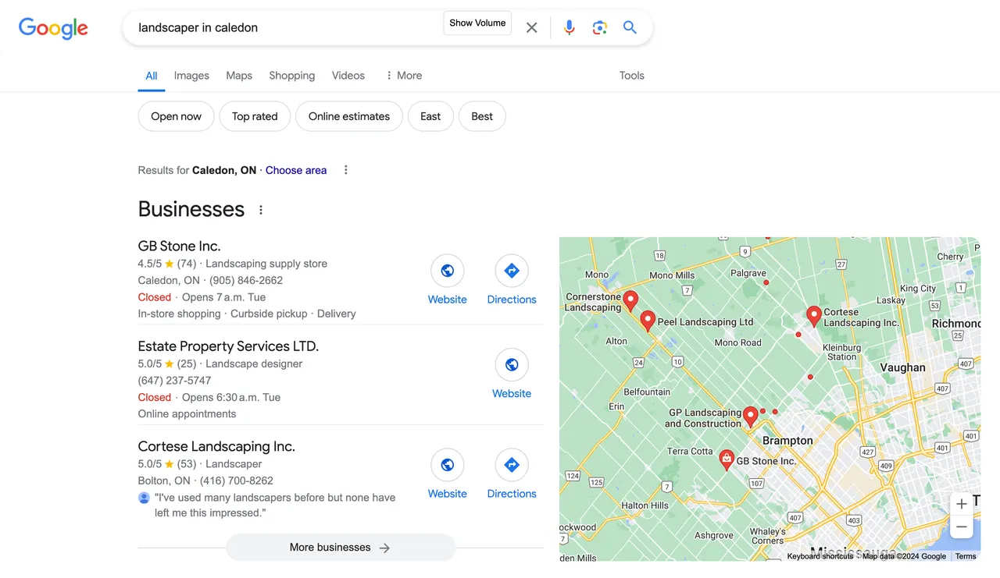

+++
author = "Renaud Gagné"
title = "3 Proven Methods to Get Free Landscaping Leads"
featured = "freelandscapingleads.webp"
url = "/landscaping-journal/free-landscaping-leads"
toc = true
date = "2024-06-04"
description = "Learn how to get free landscaping leads near you and attract more clients with these 3 proven methods."
+++

Are you struggling to find free landscaping leads? 

If so, **here’s some good news**: with just a little knowledge and some practice, you can unlock an almost infinite number of free landscaping leads. Keep reading, and we'll share with you the magic formula.

As Alex Hormozi, a renowned business coach, says:
> It's very hard to be poor when you have leads banging down your door.

Getting a lot of leads allows you to make mistakes and *still make mone*y. While free landscaping leads don't cost money, they do require an investment of time and energy.

In this article we’ll reveal three powerful methods to get free landscaping leads that will have your phone ringing off the hook, helping you grow your business without breaking the bank.

Let’s dive in and turn your landscaping business into a lead-generating machine!
## Free Landscaping Leads Stream #1: Google My Business Profile

[Google My Business (GMB)](https://business.google.com) is an essential tool for local businesses, especially for landscapers looking to attract nearby clients. Google wants to refer locally relevant search results to it's users.


Approximately 42% of all local search clicks go to the top three GMB listings, with the first position capturing the lion’s share of these clicks.


To get those free landscaper leads flowing in from Google My Business, you have to know the game and play it. Not just once, but as an ongoing business strategy that becomes part of the DNA of your business. 

It will reward you handsomely over time. Consistency is key but if you get that piece right, you can truly dominate your local market and get most of the calls and requests coming your way.

### Steps to Optimize Your GMB Profile

#### Complete Your Profile:
Your GMB profile is your digital storefront. Ensuring that all your business information is accurate and complete is crucial.
1. **Business Information:**
   - Fill out your business name, address, phone number, website, and business hours. Accuracy here ensures potential clients can easily contact you and find your location.
   - Make sure to update your information if there are any changes, such as new business hours or a new phone number.

#### Add High-Quality Photos:
Visual content is a powerful tool for attracting clients. High-quality images can showcase your work and professionalism.
1. **Types of Photos to Include:**
   - Before-and-after images of landscaping projects.
   - Team photos to add a personal touch.
   - Pictures of your equipment and tools to demonstrate your capability.
2. **Tips for Taking and Uploading Photos:**
   - Use a good quality camera or smartphone to take clear, high-resolution images.
   - Regularly update your photos to keep your profile fresh and engaging.

#### Encourage Reviews:
Reviews are a critical factor in building trust and credibility with potential clients.
1. **Strategies for Gathering Reviews:**
   - Ask satisfied clients to leave a review on your GMB profile. Personal requests often work best.
   - If you’re just starting out and don’t have many clients yet, offer your services for free or at cost in exchange for feedback and glowing reviews.
   - Respond to reviews promptly and professionally, whether they are positive or negative. This shows that you value customer feedback and are committed to providing excellent service.
2. **Detailed Scripts and Strategies:**
   - For more in-depth scripts and strategies to ensure you get reviews every time, check out our detailed article [here](/landscaping-journal/local-landscaping-seo/).


Have a card with a QR code your client can scan to leave you a review before you leave the job site.


#### Post Regular Updates:
Regular updates keep your profile active and engaging, showing potential clients that you are actively in business.
1. **Types of Updates to Post:**
   - Announcements of special offers or discounts.
   - Highlights of recently completed projects.
   - Seasonal tips and advice for maintaining lawns and gardens.
2. **Frequency and Scheduling Tips:**
   - Aim to post at least once a week to maintain a presence on your profile.
   - If you need to choose between posting on Facebook and GMB, prioritize GMB. However, ensure you post on Facebook enough (at least once a week) to look like you are still in business.

#### Use Keywords:
Incorporating relevant keywords into your GMB profile helps improve your visibility in search results.
1. **Explanation of SEO and Local Keywords:**
   - SEO (Search Engine Optimization) involves using keywords that potential clients are likely to search for.
   - Examples include "landscaping services near me," "lawn care in [Your City]," and "best landscaping company."
2. **Tips for Incorporating Keywords:**
   - Use these keywords naturally in your business description, posts, and photo captions.
   - Avoid keyword stuffing, which can negatively impact your profile’s visibility.

By optimizing your Google My Business profile, you can create a powerful online presence that attracts free landscaping leads. 

#### Facebook or GMB?
When it comes to choosing between posting on Facebook and GMB, prioritize GMB 100X but keep your Facebook active with at least one post per week to show you're still in business.

**WHAT IF YOU HAVE NO PAST CUSTOMER?** 

If you're just starting and have no past clients, offering free or discounted services in exchange for reviews is a fantastic way to get the engine going. 



## Free Landscaping Leads Stream #2: Leverage Warm Outreach
Warm outreach is a game-changer for landscaping businesses. However, many people have a bad taste or reluctance toward it because they've seen it done poorly. But there's a tasteful, effective way to do it that builds relationships rather than feeling pushy or awkward.

### Introduction to Warm Outreach:
Warm outreach involves reaching out to your warm audience—people who already know and trust you. This could be friends, family, past clients, or even acquaintances. The beauty of this method is that it's both cost-effective and highly impactful when done correctly. The key is to build rapport first, especially on social media, rather than pushing your services right away. 


Warm outreach is all about building genuine relationships and making sure everyone in your network knows what you do, without feeling like you’re trying to sell them. Stay in touch and be present, so if they need your services, they think of you first. And remember, even if they don't need your services now, they could refer you to someone who does in the future.


### Steps for Effective Warm Outreach:

1. **Identify Your Warm Audience:**
   - **Create a List:** Start by listing all your contacts from your phone, email, and social media. These are your potential leads.
   - **Categorize Contacts:** Group your contacts into categories like friends, family, past clients, and acquaintances. This helps in personalizing your messages.

2. **Craft Personalized Messages:**
   - **The Power of Personalization:** Tailor your messages to each contact. Mention something specific about them to make your outreach feel genuine.
   - **Example Message:** "Hi [Name], I noticed you just got married. Congrats!"

3. **Build Rapport:**
   - **Start a Genuine Conversation:** Engage in a real conversation without immediately mentioning your services.
   - **Example Conversation Starter:** "Saw your recent post about your new garden. It looks fantastic! How did you come up with the design?"

4. **Reach Out:**
   - **Set Daily Goals:** Aim to contact 100 people daily. Consistency is key to generating leads.
   - **Methods of Outreach:** Use calls, texts, emails, or social media messages. Choose the method that suits each contact best.
   - **Follow-Up Strategies:** If you don't get a response initially, follow up with a polite reminder.

5. **Make a Simple, Indirect Ask:**
   - **Timing Your Ask:** Once you've built rapport and the conversation is flowing, introduce your ask naturally.
   - **Crafting the Ask:** Instead of directly selling your services, ask if they know someone who might benefit.
   - **Example Ask:** "Do you know anyone who might be interested in lawn care services? We're offering the first month for free on annual plans."

6. **Ask for Referrals:**
   - **Encouraging Referrals:** After making your ask, encourage them to refer friends or family who might benefit.
   - **Example Referral Request:** "If you know anyone who could use our landscaping services, please let me know."

Warm outreach is all about building on existing relationships. By reaching out to people who already know and trust you, you can generate leads more effectively. Remember, the goal is to build rapport first and make your messages personal before introducing your offers.

### How many clients can you get with this method?

Let’s break down the potential business you can generate with warm outreach.

1. **Initial Outreach:**
   - Reach out to 100 people in your network.

2. **Response Rate:**
   - On average, about 20% (20 out of 100) will respond to your initial outreach.

3. **Engaged Leads:**
   - Out of those 20 responses, about 20% (4 out of 20) will express interest in your services or refer you to someone who is interested.

4. **Conversion Rate:**
   - Out of the 4 engaged leads, typically 1 will convert into a paying client.

**Summary:**
- For every 100 warm outreaches, you can expect:
   - 20 responses.
   - 4 engaged leads.
   - 1 new paying client.

By consistently reaching out to 100 people each day, you could generate approximately 1 new client every few days, which translates to about 10-15 new clients per month. 

## Free Landscaping Leads Stream #3: Networking

Networking is a powerful strategy for generating free landscaper leads, particularly through structured groups like the Chamber of Commerce or [BNI](https://www.bni.com/) (Business Network International). These platforms connect you with other local businesses, fostering referral opportunities and mutually beneficial relationships.

Networking involves creating relationships with other business professionals in your community. It's more than just exchanging business cards; it's about building a network of allies who can refer clients to you. BNI, for example, is a structured referral organization that ensures high trust and exclusivity by allowing only one person per professional category per chapter.


BNI has over 325,000 members worldwide and generated over $22,1 billion in business through referrals in 2014. Their structured meetings are designed to maximize referral potential and business growth. 


### Steps for Effective Networking:

First, join relevant groups such as the Chamber of Commerce, BNI, or industry-specific associations. Attend a few meetings to see if they fit your business needs. Once you've joined, attend meetings regularly, armed with business cards, a concise pitch, and a clear understanding of your services. Engage actively in discussions and show genuine interest in others’ businesses, especially **real estate agents** and **general contractors**.

Build genuine relationships by following up with new contacts and exploring potential collaborations. Offer value by sharing your expertise, providing advice, and giving referrals. This goodwill encourages others to reciprocate with referrals.

Ask for referrals clearly and confidently, explaining the type of clients you seek and how you can help them. Be proactive in giving referrals as well. Keep track of the referrals you give and receive, follow up on leads promptly, and thank those who refer clients to you.

### Running the Numbers:**

In a group with 30-50 active members, expect 1-2 referrals per member per month. With a 10-20% conversion rate, this could yield 3-5 new paying clients per month.

## Conclusion

Generating free landscaping leads is achievable through three proven methods: optimizing your Google My Business profile, leveraging warm outreach, and networking through local business groups. These strategies, while requiring time and effort, can significantly grow your business. Start implementing them today to see tangible results in your landscaping business.

To your continued success.

Cheers!

