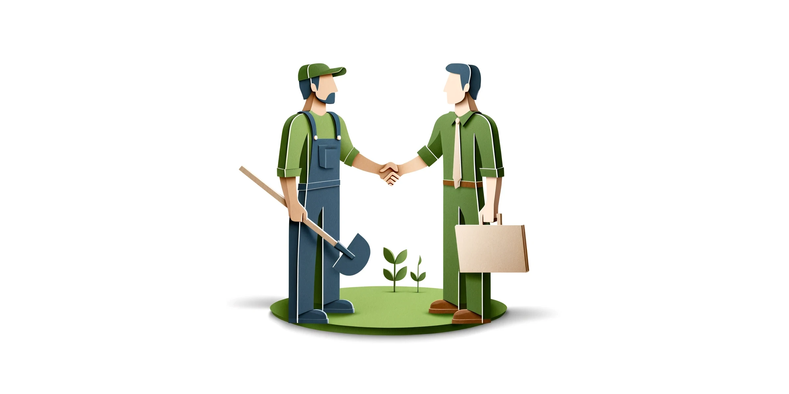

+++
author = "Renaud Gagné"
title = "How to Hire the Right Landscaping Web Design Service"
url = "/landscaping-journal/hire-landscaping-web-design-service"
date = "2024-06-02"
description = "Learn how to hire top landscaping web design services to boost build your website right."
+++

Is your landscaping business not getting enough attention online? Finding the right landscaping web design agency can change everything. But choosing the wrong one can be a disaster. This guide will help you pick the best agency, so your website can bring in more clients and show off your great work.

We’ve learned a lot from auditing hundreds of landscaping websites and working closely with our clients. We know what works and what doesn’t. Follow these steps to hire the right agency and make your website look professional and attract those high-paying clients you need.

## What to Look for in a Landscaping Web Design Agency

When you're ready to hire a landscaping web design agency, it's important to know what to look for. Here are some key things to keep in mind:

### Experience with Landscaping Websites
Look for an agency that has experience designing websites for landscaping businesses. They will understand the unique needs and challenges of your industry.

**Questions to Ask:**
- Have you designed websites for landscaping companies before?
- Can you show me examples of your work?

**Bonus Tips**: You might want to read [Level Up Your Landscaping Websites In 3 Easy Steps](/landscaping-journal/level-up-landscaping-website), in there we highlight some of the features you need to stand above the competition.

### SEO Knowledge
A good web design agency should know how to make your website easy to find on Google. This means using the right keywords and making sure your site is set up correctly.

**Questions to Ask:**
- How do you approach SEO for landscaping websites?
- Can you help my website rank higher in local searches?

**Bonus Tips**: There are best practices for local search your web designer can help with BUT a big part of ranking will also come down to knowing how to play the game. Read [Getting Leads For Landscaping Through Local SEO](/landscaping-journal/local-landscaping-seo/) to get the game plan.

### Great Customer Service
You want to work with an agency that is easy to communicate with and responsive to your needs. Good customer service is a must.

**Questions to Ask:**
- How do you handle customer support?
- Do you use a support ticket management system to handle my requests?
- Do I have to pay extra to get updates on my website?

### Positive Reviews
Check reviews from other landscaping businesses. Positive reviews can tell you a lot about an agency's reliability and quality of work.

**Questions to Ask:**
- Can you provide references or reviews from past clients?
- What do other landscaping businesses say about your services?

### Understanding of Your Goals
Make sure the agency understands your goals and can create a website that helps you achieve them. Whether it's getting more clients, showcasing your work, or building credibility, they should be able to meet your needs.

**Questions to Ask:**
- How will you ensure my website meets my business goals?
- Have you ran any paid ads before on websites like mine?

The question about paid ad is important. There are designers who "make pretty websites" and there are web design agency who have had the experience of running paid ads. The layout and strategies from someone with experience with advertising will make it so that they optimize for conversions (turning visitors into leads). 

## Cost of Hiring a Landscaping Web Design Agency

When you're thinking about hiring a landscaping web design agency, it's important to understand the costs involved. Here’s what you need to know:

### One-Time Lump Sum vs. Subscription Model
There are two main ways to pay for a web design: a one-time lump sum or a subscription model.

**One-Time Lump Sum:**  
You pay for the website all at once. This can be a big amount upfront. After that, you might have to pay extra for updates or changes. For an agency specialized in the landscaping market, you might look at something up to $20K. They might have 12 month payment plans to help with cashflow.

**Subscription Model:**  
You pay a smaller amount every month. This usually includes updates and support. It's like paying for a service that keeps your website fresh and running smoothly. Think of it like a lawn care service, there might be some heavy work up front, but then they are mostly there to keep things humming and adding pages as you grow your website.

**Note**: I'm biased for the subscription model, after a decade in the trade, I believe it is more aligned with the interest of both parties. You get to have an agency who's constantly need to please you to keep the subscription going and the agency gets paid for the maintenance work that is inevitable with every website.

### Average Cost Per Page
Websites can cost different amounts based on how many pages you need. On average, each page can cost between $100 to $500 when you speak to a generalist. If you want a landscaping web design agency, it will probably be closer to the $1000 mark. 

**Note:** All things being equal, the more page you have, the more traffic your website will get, guaranteed. When we do websites for our landscaping clients, we don't charge for every new page after the initial design. As you go out there and building your portfolio of completed projects or decide to run a new promotion, you should be able to get those pages up with a simple support ticket. Try to find an agency who would agree to such term.

### Why Invest in a Professional
If you’re just starting, you might use a DIY tool like [CARRD](https://carrd.co/). It’s cheap and easy for a beginner. When you just get started, you might have a lot more time than money. But if you want to rank high on Google and get lots of clients, hiring a pro is the way to go. Professionals know all the tricks to make your website stand out.

### Your Website is a Living Document
Remember, your website is not a one-time thing. It needs updates and changes to stay useful. This probably means having a plan to take Before-and-After pcitures of interesting projects you want to showcase. 

## Conclusion
Like said above, hiring a bad landscaping web design agency is a nightmare you want to avoid at all cost. It's like a mechanic, hiring a bad one can cost a lot more than you've bargained for. 

Your website is your digital storefront. Invest in it accordingly. 

To your continued success.

Cheers!

PS: Subscribe For More!

