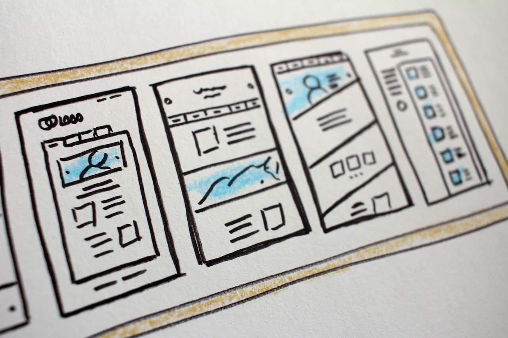
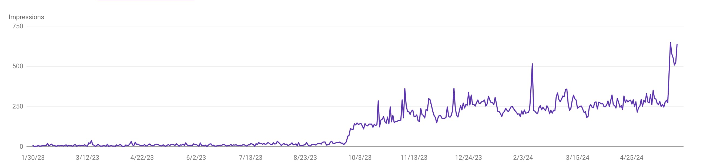
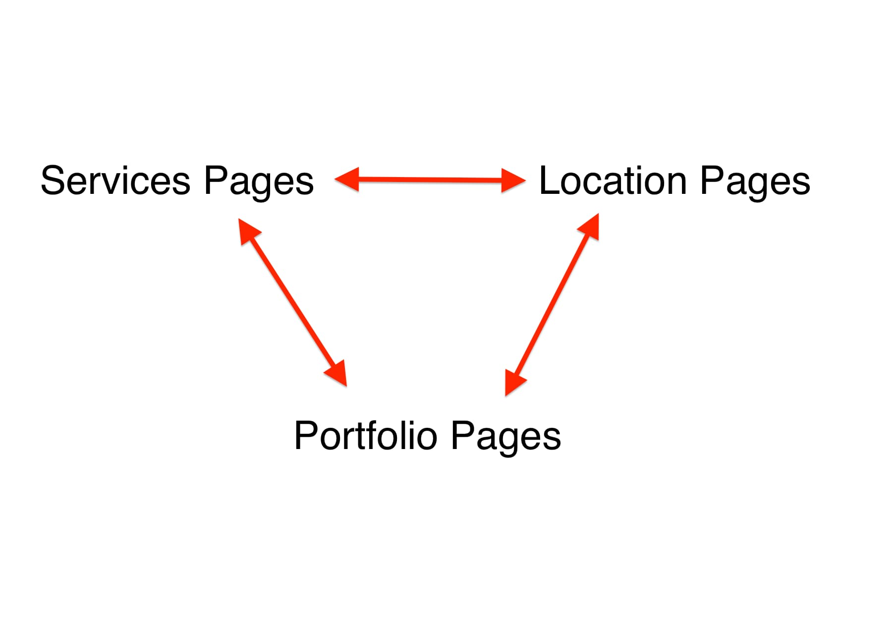
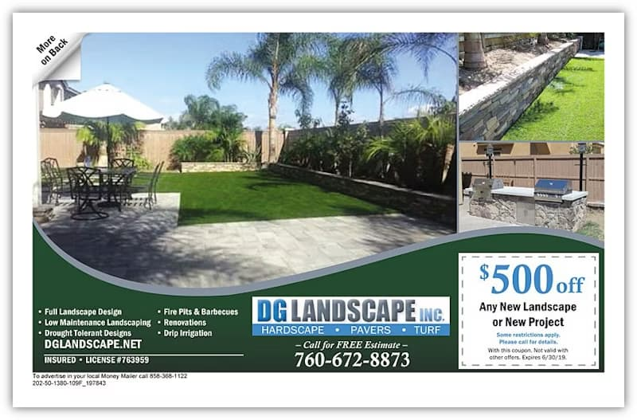

+++
author = "Renaud Gagné"
title = "3 Things Most Landscaping Websites Are Missing"
date = "2024-05-31"
description = "Discover 3 things most landscaping websites are missing and what you can do to stand above the competition."
tags = [
    "website",
]
+++

Do you have a landscaping website that feels like it's not doing as good of a job as it should? If that's the case, you are in the right place. This article aims to give you clear steps to improve your landscaping website and stand above the competition. 

The following content is the distillation of decades of experience and our team surveying hundreds of landscaping websites. We know what works and what doesn't.

Go through these 3 things and let us know if you've hit all of those points already. We would love to look at your website and feature it on our next blog. 😀

**Note:** We are not expecting you to implement the strategies below on your own; ideally, you have a good web person on your team who can do so. You have a business to run, after all!

## #1- Your Website Needs More Pages...A LOT More.

The more pages your website has, the more your website will be found on Google.

**Period.** 

Below is an image of what happened when we took the website through the steps of adding pages.

The flat line is when the website has five pages (home, about, services, testimonials and contact).

The first bump is when we create a page for each service. The last bump on the right is when we added location pages.

You would be surprised how many landscaper websites we have looked at only have 4 or 5 pages.

If you just got started, it might be what you need. But if you want to get serious traction with it, you need more pages.

### Start With Service Pages

Do you offer more than a single service? Good! Why not have a page for each where you show your prices, have Frequently Asked Questions, show service-specific testimonials and show off your masterpieces? Those pages can serve in two ways. One, they will give more in-depth information to your prospects, and second, they can rank in your local market for your services.

### Then Have Location Pages

Do you have a page for each location you are serving? If not, you are missing out on a huge opportunity. When people go to Google, how do they start their search? What do you think they type?

They type in something like "landscaper in {Location}", "Landscaping company in Toronto" or "Toronto Landscaper." If you do not have a page people can land on which specifically speaks to that market, it's a big missed opportunity.

**Bonus Tips**: Have each location page have links to your services. Google will love you for it.

### Finally, Build Your Portfolio

This is where so many drop the ball. You build a fantastic deck or patio and transform a yard…and your website doesn't show and tell about your amazing service. 😮  

From a "getting more eyeballs" perspective, your portfolio can bolster all your other pages. Suppose you have a good web designer by your side, he/she will make it so that each service page will display the portfolio pages related to the services, that the location pages display the portfolio from that location and finally, that the portfolio page boosts the ranking of your service pages AND location pages.

Here is a graph to help see the relationships between pages.

Not only will it make your website more appealing, **Google will love you for it.** The more portfolio pages you produce, the more your other pages will start ranking. 

#### Do you have time for this? Probably not.

You are busy; you have a team to run, estimates and quotes to ship…Please keep it simple, stupid(KISS). Make an arrangement with your developer that you'll send two pictures (before and after), the list of services involved, and if there is a testimonial, include it. He/She should take care of the rest and ensure the services and location are linked. That's what you are paying them for…right?

## #2- Make An Offer

"Get A Free Quote"… that's it? Who charges for a quote anyway?!
You can do better. Since 95% of landscapers only offer a "Free Quote," you might as well stand out by actually making a compelling offer.

It could be as simple as "The First Three Cuts Are On Us!" or "Early Birds Get 15% OFF," "Every job over $5000 gets a $500 Discount," or "Pay For The Year And Get One Month Of Free Service"…you get the idea. You can do better than "Free Quote".

Photo by 'Money Mailer'

When we build websites for clients, we like to create unique landing pages with specific offers that they can leverage by sending postcards or running Facebook ads in their local market. Ask your developer to at least make one so you can start testing.

## #3- Testimonials, Testimonials, Testimonials

Social proof is very important, and testimonials are the name of the game when it comes to getting clients. You should have a system to ensure that every satisfied customer leaves a review. Please don't leave it to them. Have a card with a QR code they can scan right in front of you so that they are redirected to your Google My Business Page. The velocity of your reviews (and your response to them) will make you climb the local search rankings.

Not only that, your developer can add a widget that displays all of your 5-star reviews as they come in. When your potential clients see a wall of satisfied customer testimonials, they will feel more comfortable reaching out.

## Conclusion

There is much more to making your landscaping website the best it can be. But the above will put you in a different category, bringing you more eyeballs and clients than your competition.

To your continued success.

Cheers!




