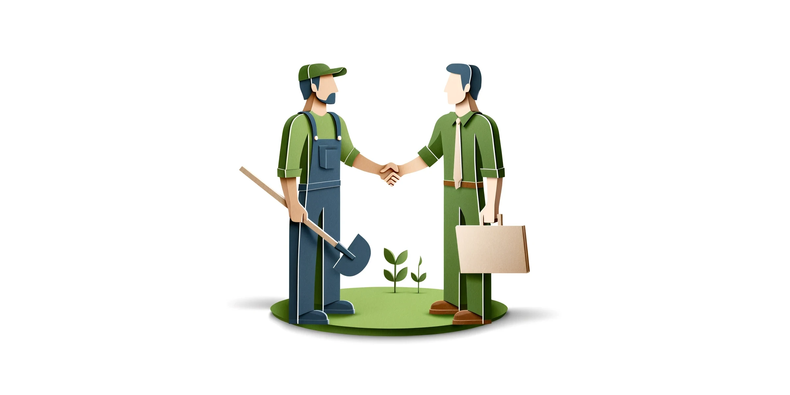
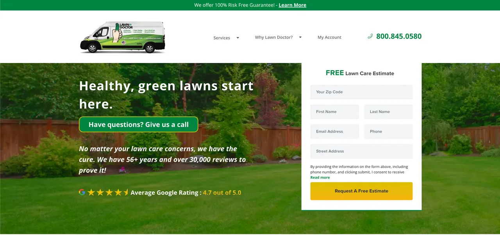

+++
author = "Renaud Gagné"
title = "7 Landscaper Website Design Tips To Get More Leads"
featured = "featured.webp"
url = "/landscaping-journal/landscaper-website-design-tips"
date = "2024-06-03"
description = "Learn 7 simple landscaper website design tips to attract more leads and grow your business."
+++

Do you want more clients for your landscaping business? A great website can help! With the right tips, your site can stand out and bring in more leads. This article will share 7 simple landscaper website design tips to get more leads and grow your business.

With over a decade in web design, we've seen trends and fads. We've personally spent millions of dollars in advertising through our client's websites and we know what works and what doesn't. 

Consider what you are about to read a distillation of a decade of experience into a few words. Bottomline, we’ve looked at hundreds of landscaping sites and know what works and what doesn’t. 

These tips are easy to follow and will make a big difference if you have a good web designer in your team who can implement them.

Ready to make your website awesome? Let’s dive in!

## Hire a Professional Specialized in Landscaping Web Design

When designing your landscaping website, it's important to hire a professional who knows your market. A generalist can do the job but, as we discovered when we speciliazed ourselves, it's the little details that count. For more information, read our article on [how to hire the right landscaping web design agency](/landscaping-journal/hire-landscaping-web-design-service/), it will save you time and headaches.

If you are bootstrapping and don't have money to hire a professional, the tips in this article might be too advanced. They require technical skills. But you do need a website somehow right?  If you need a simple website quickly that you can DIY, consider using [CARRD](https://www.carrd.co). It’s cheap and easy to use for creating a simple "brochure" website. For example, the website [clipityardcare.com](https://www.clipityardcare.com/) was made using CARRD in just a few hours. It’s a great example of what you can do on a tight budget. 

## Place Your Offer and Lead Capture Above the Fold

One of the most important tips for your landscaping website is to place your offer and lead capture above the fold. This means putting them at the top of your webpage where visitors can see them right away without scrolling down.

### What is an Offer?
An offer is something you give to your visitors to encourage them to contact you. If you can, try to go beyond the "get a free quote" offer, it's better than nothing but it isn't that compelling. Think about special deals like "First lawn care visit free" or "Get 10% off your first service.", etc. These offers grab attention and make people want to take action.

### Why "Above the Fold" Matters
Putting your offer and lead capture above the fold is crucial because most people never make it to the bottom of the page. In fact, [barely 25% of visitors scroll down past the first few screens](https://blog.c-c.com.au/how-far-will-people-scroll-down-a-web-page). By placing important information at the top, you ensure that almost everyone who visits your site sees it.

This simple change can significantly increase your website's lead generation. When people see a great offer right away, they are more likely to contact you. This helps you get more clients and grow your business.

## Design With Advertising in Mind

Next landscaper website design tips is about thinking about your website from the perspective of advertising. Most web designers have never run ads and don’t understand how their designs impact lead generation. Yikes! This means they might create a pretty site, but it won't help you get more clients.

Gary Halbert, a legendary copywriter, taught an invaluable lesson: 

> If you were on a desert island and had to send one last letter, you had to make sure the person who received it would open it and then take action to save you...how would you package that message and what would you write?

You are not on a desert island, but imagine that you just paid $5 for someone to see your website. What would you include to make the most of that visit? Imagine you have only one chance to capture your visitor's attention and get them to act.

The design and message should be clear, urgent, and emotionally engaging.

### An Attention-Grabbing Headline
Start with a headline that grabs attention. It should be clear, direct, and make visitors want to learn more. Think of it as the first thing people see – make it count!

### An Offer They Can't Say No To
Next, give them an offer they can’t refuse. It should be more than "get a free quote." Try something like "First lawn care visit free" or "Get 10% off your first service." A compelling offer encourages people to take action.

### A Clear "Next Step" They Should Take
Finally, tell them exactly what to do next. Use a strong call to action (CTA) like "Call Now," "Claim This Offer" or "Book an Appointment." Make sure it’s easy to find and understand.

## Showcase Your Masterpieces for Conversions and SEO Ranking

**Advanced landscaper website design tip:** 

One of the best ways to make your landscaping website stand out is by showcasing your masterpieces. Show off your best work! Not only does this show potential clients that you do beautiful work, but it also helps with your SEO ranking.

Portfolio pages are perfect for this. They let you display your projects in detail with photos and descriptions. This makes your website look professional and helps visitors see what you can do.

But that's not all. Portfolio pages also add more "volume" to your website. The more quality pages you have, the better your site can rank on Google. This means more people will find you when they search for landscaping services.

For example, when you create a portfolio page, you can link it to your services and location pages. This helps boost your main pages in search results. The more you connect these pages, the better your site will rank. We explain more about this relationship in our [Level Up Your Landscaping Website article](/landscaping-journal/level-up-landscaping-website/).

By adding detailed portfolio pages, you not only impress your visitors but also improve your SEO. This is a win-win for your business. Make sure to keep your portfolio updated with your latest and greatest projects to keep attracting new clients.

## Include a Thank You Page with a Scheduler

When someone fills out a form on your website, don't just lead them to a page with "Thank you." on it. Create a special Thank You page with a scheduler! This makes it easy for them to book a visit or a phone call with you.

If you use tools like [Jobber](https://getjobber.com/) or [Calendly](https://calendly.com/), you can set up a schedule that shows when you’re available. This means you don’t have to be free all the time. You can decide the best times for appointments, making it easy for both you and your clients.

### Benefits of a Scheduler on the Thank You page
Using a scheduler has many benefits:

- **Saves Time**: No more back-and-forth emails to set up a meeting.
- **Professional**: It makes your business look more organized and professional.
- **Better Lead Conversion**: When clients can easily book a time, they are more likely to follow through. This turns more leads into actual sales.

### Introduce an "Unlockable"
**Here's a cool idea:** Offer an "unlockable" bonus for booking now. For example, if they schedule a visit or call right after filling out the form, they could get a special discount or a free lawn care tip guide. This gives them an extra reason to act quickly.

## Optimize for Fast Loading Speeds

One key landscaper website design tip is to make sure your site loads quickly. Why? Because a slow website can make you lose potential clients. [Studies show](https://www.portent.com/blog/analytics/research-site-speed-hurting-everyones-revenue.htm) that a site that loads in 1 second has a much higher conversion rate than one that takes 5 seconds. In fact, websites that load in 1 second can get up to 5 times more leads than slower sites.

### Why Speed Matters
Most people won’t wait around for a slow website. If your site takes too long to load, visitors might leave before it even finishes. This means lost opportunities and fewer clients. By having a fast-loading website, you keep visitors engaged and increase the chance they will contact you for your services.

### How to Speed Up Your Site
Here are some simple ways to make your website faster:

- **Optimize Images**: Make sure your images are not too big. Compress them so they load faster.
- **Minimize Code**: Clean up your website's code. Remove any unnecessary elements to help it load quicker.
- **Use a Good Hosting Service**: A reliable hosting service can make a big difference in your site’s speed. Don't cheap out on hosting, it's like the foundation of your house.

Improving your site speed is crucial for getting more leads and growing your business. A fast website shows that you are professional and ready to serve your clients quickly and efficiently.

## Pull Testimonials Directly from Google My Business

One of the best ways to show potential clients that you do great work is by using testimonials. Testimonials are comments from your happy customers telling others how awesome your services are. But not all testimonials are the same. To make sure they look real and authentic, it's a good idea to pull them directly from Google My Business.

### Why Google My Business Testimonials?
Google My Business is a trusted place where people leave reviews. When visitors see real testimonials from Google, they know they can trust them. It’s like getting a thumbs up from a friend!

### How to Showcase Testimonials
A good web designer can help you find a way to show these testimonials on your website. They might use special tools like plugins or widgets to automatically pull the latest reviews from your Google My Business page. One of the popular one is [Elsight Google Review Widget](https://elfsight.com/google-reviews-widget).

### Benefits of Showing Testimonials
Here’s why showcasing these testimonials is so powerful:

- **Build Trust**: When people see that others are happy with your work, they are more likely to trust you.
- **Showcase Real Feedback**: Authentic testimonials show potential clients what they can expect.
- **Boost Your Credibility**: Having real reviews makes your business look more professional and reliable.

### Keep It Updated
Not a landscaper web design tip but important none the less, have a strategy to gather as many testimonials as possible. We've outlined a powerful script and strategy on our article about [Getting Leads For Landscaping Through Local SEO](/landscaping-journal/local-landscaping-seo/). 

By pulling testimonials directly from Google My Business, you ensure that your reviews are genuine and up-to-date. This simple step can make a big difference in convincing new clients to choose your landscaping services.

## Conclusion
A well-designed website is key to attracting more clients for your landscaping business. By following these seven landscaper website design tips, you'll create a site that not only looks great but also works hard to bring in leads. From placing your offer and lead capture above the fold to showcasing your best work and pulling testimonials directly from Google, each step helps you stand out and convert visitors into clients.

To your continued success.

Cheers!